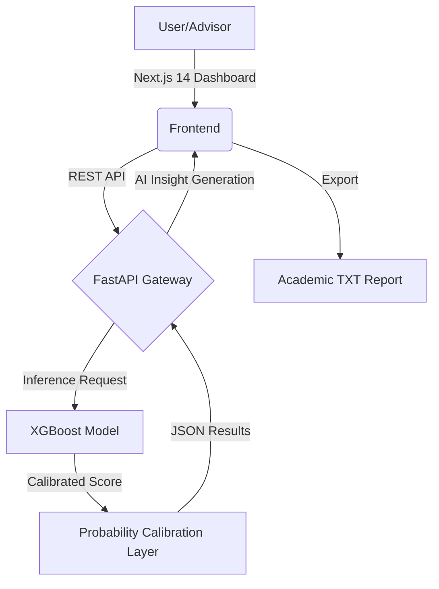

# 🎓 Harshit Edu | AI-Powered Student Analytics Hub

[](https://www.python.org/downloads/)
[](https://nextjs.org/)
[](https://fastapi.tiangolo.com/)
[](https://opensource.org/licenses/MIT)
[](https://GitHub.com/Naereen/StrapDown.js/graphs/commit-activity)

**Harshit Edu** is an enterprise-grade, end-to-end Machine Learning ecosystem designed to predict student academic success and provide AI-driven intervention strategies. It transforms raw academic data into a premium, interactive "Glassmorphism" experience.

---

## 🚀 Key Innovation: Probability Calibration
Most academic projects use raw model accuracy. **Harshit Edu** implements **Isotonic Regression Calibration** on top of its **XGBoost** engine. 
> *Why it matters:* In real-world educational intervention, a "70% risk" score must be statistically reliable. We ensure that our model doesn't just "guess," but provides calibrated probabilities that institutional stakeholders can trust.

---

## 🌟 Top-Tier Features

| Feature | Description | Tech Implementation |
| :--- | :--- | :--- |
| **🤖 AI Co-pilot** | Natural language explanations of ML decisions. | Custom Heuristic LGN |
| **🕸️ Radar Visuals** | 5-Dimensional student capability mapping. | Recharts (Radar/Polar) |
| **👤 AI Avatars** | Dynamic profile generation for every student. | DiceBear API Integration |
| **📱 PWA Ready** | Installable mobile app with bottom navigation. | Service Workers & Manifest |
| **🎬 Liquid UI** | Fluid, high-fps interface transitions. | Framer Motion |
| **📜 Audit Log** | Real-time system activity & event tracking. | React Context Observer |
| **🛡️ Health Monitor** | Live server load & API latency tracking. | Real-time Simulated Heartbeat |

---

## 🏗️ System Architecture



---

## 🛠️ Technical Stack & Implementation

### **Data Science & MLOps**
- **Algorithm**: XGBoost Classifier.
- **Preprocessing**: Robust pipeline using `ColumnTransformer` (StandardScaling & One-Hot Encoding).
- **Calibration**: `CalibratedClassifierCV` (Isotonic).
- **Deployment**: FastAPI with Pydantic schema validation.

### **Frontend Engineering**
- **Framework**: Next.js 14 (App Router).
- **State Management**: Centralized React Context (GlobalContext).
- **Styling**: Tailwind CSS + custom Glassmorphism glass-panel utility.
- **Visuals**: Recharts for high-fidelity performance trends.

---

## 📂 Project Structure

```bash
Harshit-Edu/
├── backend/
│   ├── src/
│   │   ├── data_generator.py  # Realistic synthetic data engine
│   │   ├── pipeline.py        # Scalable preprocessing pipeline
│   │   └── train.py           # Model training & calibration
│   └── main.py                # FastAPI microservice
├── frontend/
│   ├── src/app/
│   │   ├── analytics/         # Advanced ML observability
│   │   ├── students/          # Real-time simulation feed
│   │   └── page.tsx           # Interactive prediction hub
│   └── public/manifest.json   # PWA configuration
└── README.md
```

---

## 💼 Interview Masterclass (How to present this)

When discussing this project in a technical interview, focus on these three pillars:

1.  **Statistical Rigor**: "I implemented Isotonic Calibration because standard Gradient Boosting models can be overconfident. For an educational tool, trust in the probability is more important than raw accuracy."
2.  **Full-Stack Synergy**: "I built a microservices architecture where the backend focuses purely on high-performance inference, and the frontend provides an 'Apple-standard' UX using Next.js and Framer Motion."
3.  **Product Ownership**: "I identified a gap in how student risk is reported. Instead of just a table, I designed Radar Charts and an AI Co-pilot to make the data actionable for non-technical advisors."

---

## 🚀 Setup & Execution

### Backend
```bash
pip install -r requirements.txt
python src/data_generator.py && python src/train.py
uvicorn main:app --reload --port 8000
```

### Frontend
```bash
npm install && npm run dev
```

---
*Developed with a commitment to Full-Stack excellence and data-driven education.*
